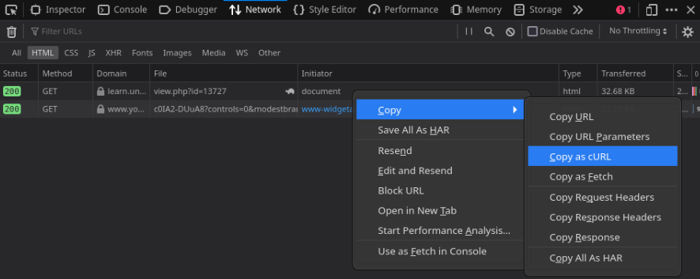

# Learn Downloader

Download all files from https://learn.univpm.it courses!

## Installation
```
sh -c "$(curl -fsSL https://raw.githubusercontent.com/alema-r/learndownloader/main/install.sh)"
```
This will install the script in `/usr/local/bin/learndownloader` and so sudo privileges are required.

## Usage
- Login and go to the learn course 
- Open the developer tools (<kbd>Ctrl + Shift + I</kbd> or <kbd>F12</kbd>)
- Head to the Network tab
- Reload the page
- Filter for HTML only
- Right click on the request -> copy -> copy as curl

- In a terminal write the command (make sure to surround the copied curl command with double quotes):
```
learndownloader "curl_command"
```
- All the files are now downloaded in the current folder
- Alternatively, you can specify a custom directory where to download files using the `-d` option, like so:
```
learndownloader -d mydir "curl_command"
```

### SSL Legacy renegotiation
By default a custom openssl config is used because https://learn.univpm.it uses a TLS version < 1.3.
The openssl config is stored at `~/.config/learndownloader/openssl.conf`.
